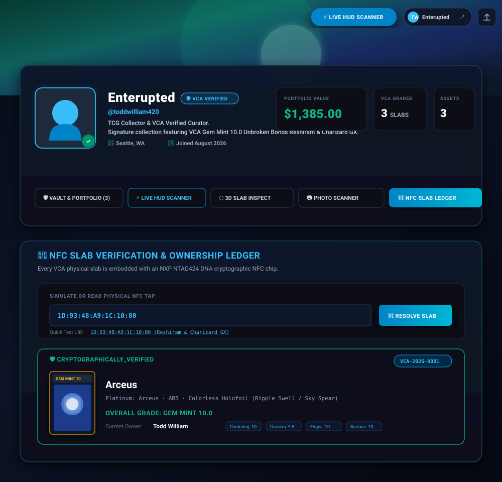
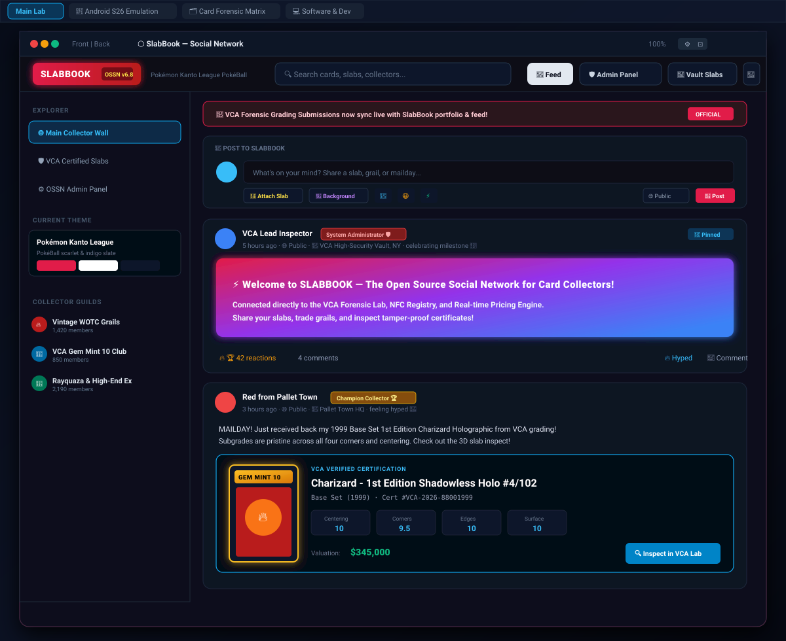

# 🌐 VCA OS — Verified Card Authority & AI Autonomous Operating System

[](https://www.typescriptlang.org/)
[](https://react.dev/)
[](https://tailwindcss.com/)
[](https://nodejs.org/)
[](https://ai.google.dev/)
[](https://www.nxp.com/)

**VCA OS** is an operating system running directly inside the browser and backed by a direct Linux host IPC subsystem. It bridges **Autonomous AI Multi-Agent Software Engineering**, **Real Host Process Execution**, and **Forensic Collectible Authentication & Optical Subgrade Intelligence (Verified Card Authority)**.

---

## 🔗 Live Application

[**https://vcacomputer.vercel.app/**](https://vcacomputer.vercel.app/)

---

## 📸 Operating System Preview


---

### 🛡️ Verified Card Authority — Holographic Slab


---

### 👤 Collector Profile & Cryptographic NFC Ledger
Verified collector profile featuring portfolio valuation, vault assets, live HUD scanner access, and cryptographic NXP NTAG424 DNA NFC chip tap resolution.



---

### 🌐 SlabBook — The Collector Social Network (OSSN v6.8)
Full-featured Open Source Social Network (OSSN) integrated directly into VCA OS, with the Pokémon Kanto League PokéBall theme, rich multi-media composer (photos, GIFs, YouTube videos, links), 3D interactive slab embeds, live grading sync, and collector guilds.



---

## 🏛️ System Architecture


---

## 🌟 Core System Capabilities

### 1. 🪟 Advanced Desktop Window Manager & Customization
* **Multi-Windowing Engine**: Floating draggable windows with active z-index elevation, minimized trays, smooth maximize transitions, and snap zones (Left, Right, Full, Center).
* **Isolated Traffic Light Controls**: Strict click containment preventing drag interference when closing, minimizing, or restoring windows.
* **Global System TopBar & Menu Tray**: Real-time clock, CPU load gauges, memory allocation, workspace switcher, and single-click window tile/close commands.
* **Frosted Glass Dock & Global Command Palette**: Quick-launch dock with magnification and unified `Cmd/Ctrl + K` command search for rapid navigation.
* **Dynamic Live Desktop Widgets Layer**: Customizable desktop widgets for hardware telemetry, agent swarm queues, active notes, and memory tracking.
* **Side Tools & System Utilities Drawer**: Right-edge slide-out drawer providing 1-click access to system monitors, active ports, hardware specs, and quick launchers.

### 2. ⚡ Autonomous AI Coding Agents Swarm
* **Full-Stack Autonomous Pipeline**: Transforms natural language prompts into working full-stack applications with synthesized frontend components and backend Express routes.
* **Self-Healing AST Debugger**: Continuously monitors backend runtime `stderr` logs, diagnoses syntax or missing npm module errors, and repairs broken code automatically.
* **Process & Port Supervisor**: Automatically detects port collisions (e.g., allocating `:3001` or `:3002`), spawns background processes, and establishes live preview iframe routing.
* **Human-in-the-Loop Security Gates**: Built-in verification steps requiring explicit user approval before executing sensitive system or file-overwrite actions.

### 3. 🛡️ Verified Card Authority (VCA) Forensic Lab & Hardware Authentication
* **Sub-Millimeter Optical Subgrading**: Multi-point computer vision inspection analyzing Centering (L/R and T/B ratios), Corner sharp radiuses, Edge wear/whitening, and Surface hologram sheen.
* **Physical NFC Slab Binding**: Integrates with NTAG215 cryptographic chips via AES-128 key generation, permanently linking physical collectible slabs to tamper-proof digital certificates.
* **Live Market Valuation Sentinel**: Real-time auction volatility analyzer aggregating recent sales data across major auction registries with historical trend charts.
* **3D Holographic Slab Visualizer**: Interactive 3D rendered card slabs with real-time lighting reflection and grade certification breakdown.

### 4. 🐚 Direct Host Linux IPC & Interactive Shell Subsystem
* **Real Interactive Terminal**: Full bash shell integration backed by Node.js `child_process` runtime with process spawning and real-time streaming output.
* **Native Filesystem Operations**: Atomic directory tree traversal, file creation, editing, deletion, and regex search across the workspace.
* **Live System Telemetry**: Kernel metrics, CPU core utilization, memory heap monitoring, disk allocation, and active network ports.

### 5. 📦 Integrated Native Application Ecosystem
| Application | Description |
| :--- | :--- |
| **🛡️ VCA Forensics** | Professional collectible grading lab, optical inspection, and NFC chip binding. |
| **⬡ SlabBook (OSSN)** | Open Source Social Network (v6.8) for card collectors with live grading sync, guilds, and rich media sharing. |
| **👤 Collector Portal & NFC Ledger** | Personal collector portfolio, real-time valuation, and hardware cryptographic NTAG424 DNA NFC resolution. |
| **⚡ Coding Agents Lab** | Autonomous multi-agent software engineering studio with live preview and debugger. |
| **🐚 Terminal Shell** | Direct Linux container terminal with package manager and git workflows. |
| **📝 Code IDE** | Full source code editor with syntax tree view, multi-file navigation, and execution. |
| **📊 AI Slides Studio** | AI-generated slide decks with live full-screen presentation mode. |
| **🛍️ Extensions Marketplace**| Curated registry of verified AI agents, forensic modules, and custom themes. |
| **🔑 Encrypted Secrets Vault**| AES-256-GCM zero-knowledge client secret and API key store. |
| **📈 Observability & Audit Log**| Immutable system event trace recording all agent and kernel actions. |
| **📁 File Explorer** | Desktop file manager with folder navigation, upload, download, and file inspection. |
| **⚙️ Process Manager** | Task manager displaying active PIDs, kill triggers, and CPU/RAM usage. |
| **🌐 Browser & App Builder** | In-OS sandboxed web browser and visual widget creator. |
| **📄 Docs, Sheets & Mail** | Native productivity suite with real-time editing and formula calculation. |

---

## 🚀 Quick Start & Local Setup

### Prerequisites
* **Node.js** v20.0.0 or higher
* **npm** or **bun** / **yarn**

### 1. Clone the Repository
```bash
git clone https://github.com/your-username/vca-os.git
cd vca-os
```

### 2. Install Dependencies
```bash
npm install
```

### 3. Configure Environment Variables
Copy `.env.example` to `.env` and provide your Google Gemini API key:
```bash
cp .env.example .env
```
Inside `.env`:
```env
GEMINI_API_KEY=your_gemini_api_key_here
```

### 4. Launch the Development Server
```bash
npm run dev
```
Open your browser and navigate to:
```
http://localhost:3000
```

---

## 🛠️ Build & Production Deployment

To compile and bundle both the React frontend and the Express Node.js IPC server into a standalone production release:

```bash
# Compile frontend with Vite and bundle backend with esbuild
npm run build

# Start the compiled production server
npm run start
```

---

## 📁 Repository Structure

```
├── assets/                          # SVG UI previews and architectural diagrams
│   ├── vca-os-desktop-preview.svg   # Primary desktop workspace preview
│   ├── vca-os-architecture.svg      # Multi-agent & subsystem architecture diagram
│   ├── vca-user-profile-preview.svg # Collector profile & NFC ledger visual preview
│   └── vca-slabbook-preview.svg     # SlabBook OSSN social platform preview
├── src/
│   ├── App.tsx                      # Root Desktop Workspace & Layer Composer
│   ├── main.tsx                     # React 19 Client Entrypoint
│   ├── index.css                    # Tailwind CSS v4 styling rules
│   ├── components/
│   │   ├── apps/                    # Integrated Application Suite
│   │   │   ├── CodingAgentsApp.tsx  # Autonomous AI Coding Swarm Studio
│   │   │   ├── VCAApp.tsx           # Forensic Collectible Lab & 3D Slab
│   │   │   ├── SlabBookApp.tsx      # Open Source Social Network (OSSN) Collector Hub
│   │   │   ├── TerminalApp.tsx      # Linux Host Terminal Shell
│   │   │   ├── CodeApp.tsx          # Code IDE & Workspace Editor
│   │   │   ├── SlidesApp.tsx        # AI Slide Decks & Presentation Engine
│   │   │   ├── MarketplaceApp.tsx   # Verified Extension & Agent Store
│   │   │   ├── SecurityApp.tsx      # Encrypted Secret Key Vault
│   │   │   ├── ActivityApp.tsx      # Observability & Audit Event Trace
│   │   │   ├── ProcessManagerApp.tsx# Task & PID Activity Monitor
│   │   │   ├── FilesApp.tsx         # File System Explorer
│   │   │   ├── DocsApp.tsx          # Document Editor
│   │   │   ├── SheetsApp.tsx        # Spreadsheet Calculator
│   │   │   └── SettingsApp.tsx      # Wallpaper & System Preferences
│   │   ├── desktop/                 # Desktop OS Shell Components
│   │   │   ├── TopBar.tsx           # Menu Bar, Status Indicators & System Tray
│   │   │   ├── Dock.tsx             # Frosted Glass Application Launcher Dock
│   │   │   ├── WindowFrame.tsx      # Window Layout, Resize & Traffic Lights
│   │   │   ├── SideToolsPanel.tsx   # Side Utility Drawer & Telemetry Sentinel
│   │   │   ├── DesktopWidgets.tsx   # Live Floating Desktop Information Cards
│   │   │   ├── DesktopIcons.tsx     # Desktop Shortcuts Grid
│   │   │   ├── CommandPalette.tsx   # Cmd/Ctrl+K Quick Search
│   │   │   ├── NotificationCenter.tsx # OS Notifications & Approval Toasts
│   │   │   └── QuickSettings.tsx    # Audio, Display, Network & Mode Toggles
│   │   ├── public/                  # Public Collector Portals & Slabs
│   │   │   ├── UserPortal.tsx       # Collector Profile & Cryptographic NFC Ledger
│   │   │   └── PublicVerification.tsx # Public VCA Cert & QR Verification
│   │   └── engineering/             # Technology Registries & Hardware Bridge
│   ├── context/
│   │   ├── OSContext.tsx            # Global Windowing & Operating System State
│   │   └── VCAContext.tsx           # Forensic Grading & NFC Hardware State
│   └── types/
│       ├── os.ts                    # TypeScript Interfaces for Windows & Apps
│       └── vca.ts                   # Forensic Subgrade & Collectible Types
├── server.ts                        # Express IPC Server, Process & File APIs
├── server_ossn.ts                   # SlabBook OSSN backend endpoints & social data
├── server_pricing_api.ts            # Live market valuation & pricing adapters
├── server_scanner_api.ts            # High-res optical scanner bridge
├── server_vca_api.ts                # VCA certification & ledger endpoints
├── metadata.json                    # Application Manifest & Cloud Run Config
├── package.json                     # Project Dependencies & Build Scripts
├── tsconfig.json                    # Strict TypeScript Compiler Config
└── vite.config.ts                   # Vite 6 Bundler Configuration
```

---

## 🔒 Security & Sandboxing Standards

* **Zero-Knowledge Vault**: API keys and tokens are stored encrypted and are never transmitted in cleartext over public networks.
* **Process Boundary Isolation**: All command execution spawned by terminal or agent swarms runs within sandboxed cgroups with output sanitization.
* **Strict CORS & Iframe Policy**: Dev servers and sub-previews bind exclusively to local loopback ports with strict origin validation.

---

## 📄 License

Distributed under the **MIT License**. See `LICENSE` for more information.
